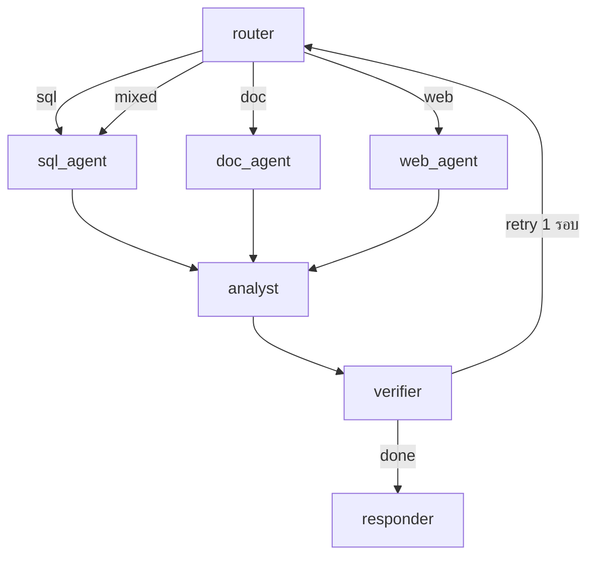

# Thai Data Analyst Agent (LangGraph + Text2SQL)

> ระบบถาม-ตอบภาษาไทยสำหรับงานวิเคราะห์ข้อมูล ซึ่งแปลงคำถามภาษาธรรมชาติเป็น SQL ดึงข้อมูลจาก PostgreSQL สร้างกราฟ และตอบพร้อมแหล่งที่มาที่ตรวจสอบได้

ตัวอย่างเช่น คำถาม *"Top 5 หมวดขายดีสุดคืออะไร"* ระบบจะส่งคืนตัวเลขสรุป กราฟประกอบ และ SQL ที่ใช้ในการค้นข้อมูลภายในครั้งเดียว



## ความสามารถหลัก

- **การวิเคราะห์เชิงตัวเลข** — เช่น `ยอดขายแต่ละหมวดคือเท่าไหร่` ระบบจะสร้าง SQL ประเภท `GROUP BY` พร้อมกราฟแท่งประกอบ (ตัวอย่างเพิ่มเติมใน `data/questions_gold.jsonl`)
- **การค้นคืนเอกสาร** — เช่น `นโยบายคืนสินค้าคืออะไร` ระบบจะค้นจากฐานเอกสารภายในเพื่อประกอบคำตอบ
- **การค้นคืนข้อมูลภายนอก** — เช่น `ข่าวราคาตลาดข้าวล่าสุด` ระบบจะค้นจากเว็บและสรุปผล
- **คำถามแบบผสม** — เช่น `เทียบยอดขายหมวดแฟชั่นกับนโยบายส่วนลด` ระบบจะรวมข้อมูลจากฐานข้อมูลและเอกสารเข้าด้วยกัน

ทุกคำตอบประกอบด้วย SQL ที่ใช้ จำนวนแถวที่ค้นพบ กราฟ (หากมี) และรายการแหล่งที่มา

## Tech Stack

### API Layer

| Stack | หน้าที่ |
|:------|:---------|
| `fastapi` | ให้บริการ REST API (`api/main.py`): `POST /v1/ask`, `GET /v1/trace/{id}`, `GET /health` |
| `uvicorn` | ASGI server สำหรับให้บริการ FastAPI (กำหนดใน `Dockerfile`) |
| `sse-starlette` | สตรีมสถานะแบบ Server-Sent Events: `thinking → plan → sql → rows(n) → chart → answer` |
| `pydantic v2` | ตรวจสอบความถูกต้องของ request/response (`api/schemas.py`) |

### Agent Orchestration

| Stack | หน้าที่ |
|:------|:---------|
| `langgraph` | จัดลำดับการทำงาน (`agent/graph.py`): `router → sql/doc/web → analyst → verifier → responder` พร้อมรองรับการลองใหม่ 1 รอบ |
| `langchain-core` | จัดเตรียม `ChatPromptTemplate` สำหรับโหมดที่เปิดใช้ LLM โดยการติดตั้งพื้นฐานสามารถทำงานแบบ offline ได้ |
| `pyyaml` | จัดเก็บ system prompt ภาษาไทยไว้ที่ตำแหน่งเดียว (`agent/prompts.yaml`) สามารถปรับกติกาโดยไม่ต้องแก้ไขโค้ด |
| `httpx` | HTTP client สำหรับ Brave Search ในกรณี fallback |

### Data และ Text2SQL

| Stack | หน้าที่ |
|:------|:---------|
| `postgres:16` | ฐานข้อมูลหลัก ประกอบด้วย 5 ตาราง ได้แก่ `customers, products, orders, order_items, policies` และ seed อัตโนมัติจาก `data/seed.sql` |
| `psycopg (binary)` | Driver เชื่อมต่อฐานข้อมูล (`agent/tools/sql_tool.py`) โดยบังคับ `statement_timeout=10s` และ `READ ONLY` ทุกครั้ง |
| `redis:7` | บริการสำรองใน compose (`REDIS_URL`) สำหรับ session/cache ในอนาคต ปัจจุบันยังไม่มีการเรียกใช้ |

### การสร้างกราฟภาษาไทย

| Stack | หน้าที่ |
|:------|:---------|
| `matplotlib (Agg)` | สร้างกราฟ bar/line เป็น PNG แบบ headless (จำกัด top 20 แถว) |
| `pillow` + `libraqm0` + `fonts/GoogleSans-*` | แสดงผลข้อความภาษาไทย (หัวข้อ ป้ายแกน และ tick) ด้วย RAQM layout เพื่อการวางสระและวรรณยุกต์ที่ถูกต้อง |
| `charts/` volume | จัดเก็บไฟล์ PNG ที่สร้างแล้ว โดยส่ง path กลับผ่าน event `chart` |

### ส่วนเสริม (Optional)

| ความต้องการ | Stack | การตั้งค่า |
|:------------|:------|:------------|
| ใช้ LLM ช่วยจำแนก intent / เขียน SQL | `langchain-google-genai` (Gemini) หรือ `langchain-openai` (fallback) | `SQL_LLM=1`, `ROUTER_LLM=1` |
| ค้นเว็บจริง | `tavily-python` (หลัก), Brave (สำรอง) | `TAVILY_API_KEY` / `BRAVE_API_KEY` |
| ค้นเอกสารภายใน | `chromadb` (reuse จาก Project 1, collection `docs`) | `CHROMA_HOST` |

> [!NOTE]
> หากไม่กำหนด key ใดๆ ระบบยังคงทำงานแบบ offline ด้วย template SQL (`draft_sql`) router แบบ rule-based และ mock doc/web — เหมาะสำหรับการพัฒนาและทดสอบด้วย `ANALYST_DB_OFFLINE=1 pytest -q`

### Development และ Evaluation

| Stack | หน้าที่ |
|:------|:---------|
| `pytest` | ป้องกัน regression: `test_sql_guardrails.py` (10 กรณีโจมตีต้องถูกบล็อกทั้งหมด) และ `test_graph.py` (smoke 3 เส้นทาง) |
| `evals/run_eval.py` + `evals/tasks.jsonl` | ประเมิน router accuracy และ attack block rate แล้วเขียนผลใน `evals/report.md` |
| LangSmith | ตรวจสอบ trace ฉบับเต็มผ่าน `GET /v1/trace/{id}` เมื่อกำหนด `LANGSMITH_API_KEY/PROJECT` |
| `docker compose` | รวมบริการ `api + postgres + redis` ไว้ในคำสั่งเดียว |

## Quickstart

```bash
cp .env.example .env
docker compose up --build
# seed จะถูกโหลดอัตโนมัติจาก data/seed.sql

curl -N -X POST localhost:8000/v1/ask \
  -H 'Content-Type: application/json' \
  -d '{"question_th": "Top 5 หมวดขายดีสุดคืออะไร"}'
```

ระบบจะส่ง event ตามลำดับ `thinking → plan → sql → rows(n) → chart → answer` จากนั้นสามารถตรวจสอบขั้นตอนกลางด้วย

```bash
curl localhost:8000/v1/trace/<trace_id>
```

## Local Development (ไม่ใช้ Docker)

```bash
python -m venv .venv && source .venv/bin/activate
pip install -r requirements.txt
ANALYST_DB_OFFLINE=1 pytest -q        # ทดสอบแบบไม่ต้องมีฐานข้อมูล
python evals/run_eval.py               # สร้าง evals/report.md ใหม่
ANALYST_DB_OFFLINE=1 python -c "from agent.graph import ask; print(ask('ยอดขายแต่ละหมวดคือเท่าไหร่')['answer'])"
```

> [!TIP]
> ใน Docker ได้ติดตั้ง `libraqm0` สำหรับการแสดงผลฟอนต์ไทยไว้แล้ว หากรันแบบ local และพบปัญหาการแสดงผล โปรดตรวจสอบว่า Pillow เปิดใช้ RAQM (`python -c "from PIL import features; print(features.check('raqm'))"`) หรือพิจารณารันผ่าน Docker

## API Reference

| Method | Path | คำอธิบาย |
|:-------|:-----|:----------|
| POST | `/v1/ask` | รับ `{question_th, session_id}` ส่งกลับ SSE ตั้งแต่เริ่มประมวลผลจนตอบเสร็จ |
| GET | `/v1/trace/{id}` | แสดงขั้นตอนกลางและลิงก์ LangSmith |
| GET | `/health` | ตรวจสอบสถานะของเซิร์ฟเวอร์ |

## Security และ Guardrails

> [!IMPORTANT]
> ข้อควรทราบก่อนเปิดให้บุคคลภายนอกใช้งาน
>
> - เชื่อมต่อฐานข้อมูลแบบ read-only พร้อม timeout 10 วินาที และเติม `LIMIT 100` โดยอัตโนมัติ
> - บล็อกคำสั่งเขียน (`DROP, DELETE, UPDATE, INSERT, ALTER, GRANT, COPY, ...`) พร้อมระบุเหตุผล
> - ปิดบัง email/เบอร์โทรก่อนส่งเข้า LLM หากตรวจสอบไม่ผ่านจะลองใหม่ได้ 1 รอบ ก่อนตอบว่าไม่สามารถดำเนินการได้พร้อมเหตุผล

## Evaluation

ผลการประเมินอยู่ใน `evals/report.md` เป้าหมายที่กำหนดคือ SQL exec ≥ 0.80, tool-select ≥ 0.85, task success ≥ 0.75 และป้องกันการโจมตีได้ 10/10

<details>
<summary>Project structure</summary>

```
api/main.py              # FastAPI + SSE, จัดเก็บ trace ใน memory
api/schemas.py           # Pydantic schemas
agent/graph.py           # ประกอบกราฟ + ask()
agent/state.py           # AgentState ส่วนกลาง
agent/prompts.yaml       # prompt ภาษาไทยของทุก node
agent/nodes/router.py    # จำแนก sql/doc/web/mixed + LLM override
agent/nodes/sql_agent.py # template Text2SQL + LLM override
agent/nodes/doc_agent.py # Chroma + mock fallback
agent/nodes/web_agent.py # Tavily → Brave → mock
agent/nodes/analyst.py   # รวม rows/docs/web → draft + สร้างกราฟ
agent/nodes/verifier.py  # ตรวจสอบ SQL/ข้อมูล, retry 1 รอบ
agent/nodes/responder.py # ตอบภาษาไทย + SQL + sources
agent/tools/sql_tool.py  # denylist, single-statement, auto LIMIT, mask PII
agent/tools/chart_tool.py# สร้างกราฟภาษาไทยด้วย RAQM
agent/tools/search_tool.py# ค้นเว็บ 3 ระดับ
data/seed.sql            # schema + seed ภาษาไทย + policies
data/questions_gold.jsonl# 5 คำถามอ้างอิง Q→SQL→route
evals/                   # tasks + runner → report.md
tests/                   # guardrail + graph tests
charts/                  # PNG output
```

</details>
