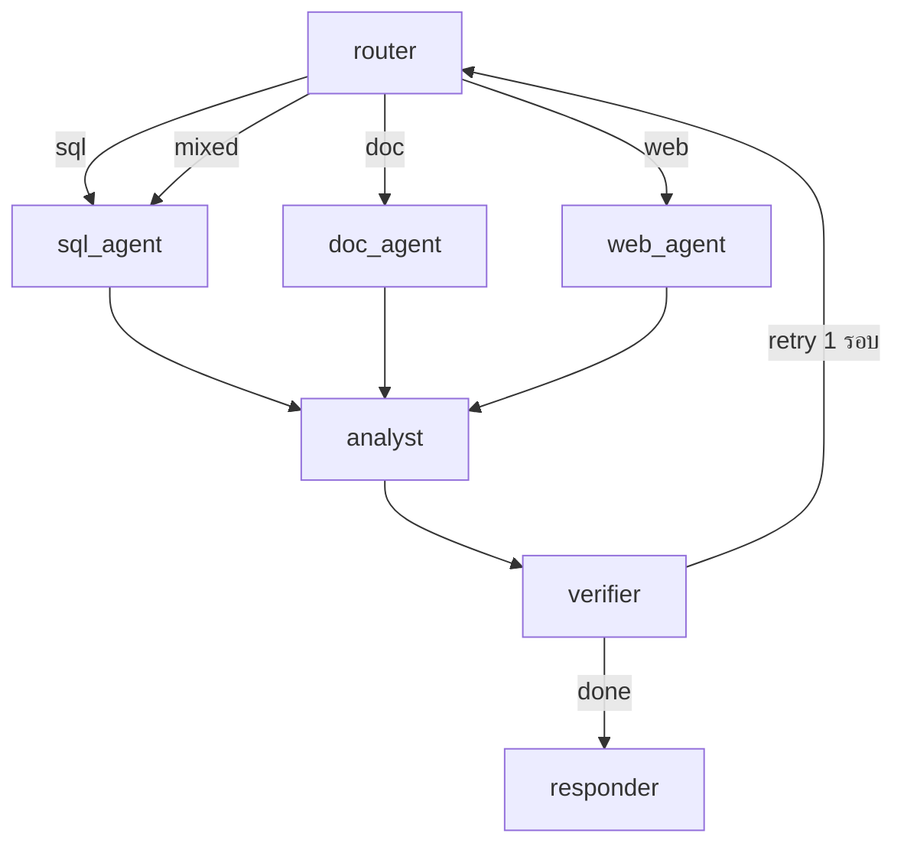

# Thai Data Analyst Agent (LangGraph + Text2SQL)

> ถามไทย → agent เขียน SQL → query PostgreSQL → วาดกราฟ → ตอบพร้อม source



## Quickstart

```bash
cp .env.example .env
docker compose up --build
# seed รันอัตโนมัติจาก data/seed.sql

curl -N -X POST localhost:8000/v1/ask \
  -H 'Content-Type: application/json' \
  -d '{"question_th": "Top 5 หมวดขายดีสุดคืออะไร"}'
```

events: `thinking → plan → sql → rows(n) → chart → answer`

```bash
curl localhost:8000/v1/trace/<trace_id>
```

## Local dev (ไม่ใช้ docker)

```bash
python -m venv .venv && source .venv/bin/activate
pip install -r requirements.txt
ANALYST_DB_OFFLINE=1 pytest -q        # tests แบบ offline
python evals/run_eval.py               # regen evals/report.md
ANALYST_DB_OFFLINE=1 python -c "from agent.graph import ask; print(ask('ยอดขายแต่ละหมวดคือเท่าไหร่')['answer'])"
```

## API

| Method | Path | รายละเอียด |
|:-------|:-----|:------------|
| POST | `/v1/ask` | `{question_th, session_id}` → SSE: `thinking → plan → sql → rows → chart → answer` |
| GET | `/v1/trace/{id}` | intermediate steps + LangSmith link |
| GET | `/health` | liveness |

## Guardrails

- DB user read-only, `statement_timeout=10s`, auto `LIMIT 100`
- Denylist: `DROP, DELETE, UPDATE, INSERT, ALTER, GRANT, COPY, ...` → ปฏิเสธพร้อมเหตุผล
- PII mask (email/เบอร์โทร) ก่อนส่งเข้า LLM, verifier retry 1 รอบแล้ว fail แบบสุภาพ

## Eval

ดู `evals/report.md` — targets: SQL exec ≥ 0.80, tool-select ≥ 0.85, task success ≥ 0.75, attacks 10/10
